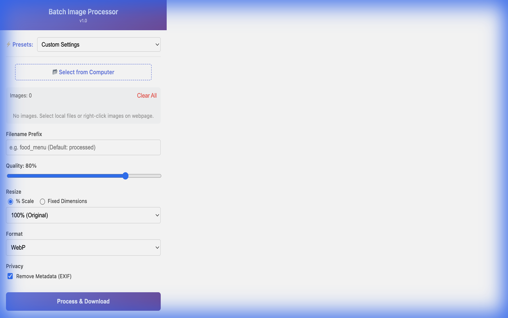
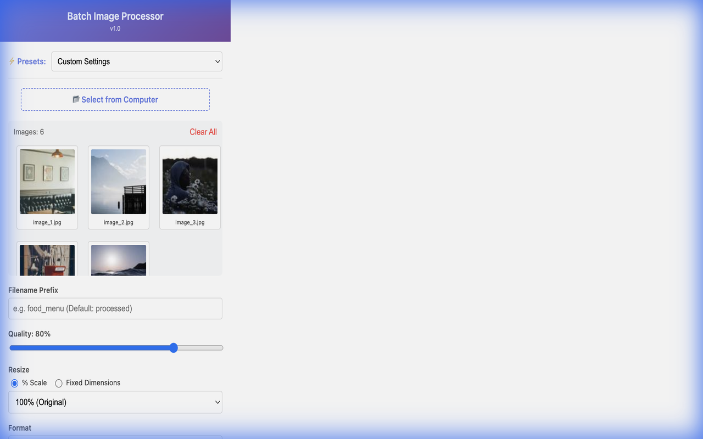

# Batch Image Processor

A powerful, privacy-focused tool for batch image processing, editing, and optimization. Available as a **Web App** and **Browser Extension**.

**[🌐 Web App](https://jiangmitravel.github.io/beijingfoodmenu-image-tools/)** | **[🛒 Chrome Web Store](https://chromewebstore.google.com/detail/batch-image-processor/imdnoejhpdnldanhpmniljcckpcbkhdj)** | **[📦 GitHub Repository](https://github.com/jiangmitravel/beijingfoodmenu-image-tools)**

## 🌟 Key Features

- **Batch Processing**: Process multiple images simultaneously.
- **Privacy First**: All processing happens entirely in your browser/local device. No data is uploaded to any server.
- **Smart Resizing**: Percentage-based scaling or fixed width with auto-calculated height.
- **Format Conversion**: Convert to JPEG, PNG, or WebP.
- **Flexible Naming**: Custom prefix, suffix, or sequential numbering.
- **Metadata Removal**: Option to strip EXIF data for privacy.
- **One-Click Presets**: Quickly switch between Social (1080p), Web (WebP), and Print settings.
- **Built-in Editor**: Crop images with multiple aspect ratios (Free, 1:1, 4:3, 16:9, 3:2).

## 🧩 Browser Extension Features

The Browser Extension enhances your workflow by allowing you to collect images from anywhere:

- **Bulk Page Grabber**: Right-click -> "Process All Images on Page" to instantly extract all images from a website.
- **Multi-Tab Collection**: Collect images from different tabs into a single queue.
- **Local Batch Upload**: Drag & drop or select multiple files from your computer.
- **Visual Gallery**: Review, edit, and organize your image queue before downloading.

## 🚀 Quick Start

### 🌐 Web Version
[**Launch Web App**](https://jiangmitravel.github.io/beijingfoodmenu-image-tools/) — No installation required. Perfect for local files.

### 🧩 Browser Extension

**[⬇️ Install from Chrome Web Store](https://chromewebstore.google.com/detail/batch-image-processor/imdnoejhpdnldanhpmniljcckpcbkhdj)**

Or build from source (see [BUILD.md](BUILD.md) for instructions).

## 📸 Screenshots

### Extension Popup Interface

*Initial upload interface with settings panel*

*Image gallery with batch processing controls*

*Detailed processing settings and options*

## 🛠️ Technical Details

- **Input Formats**: JPEG, PNG, WebP, BMP, GIF
- **Output Formats**: JPEG, PNG, WebP
- **Tech Stack**: Pure HTML/CSS/JavaScript (NO external dependencies besides JSZip).
- **Multi-Platform**: Single codebase builds for Chrome and Edge using automated build system.

## 🔧 Development

This project uses a **single-source, multi-build** system. See [BUILD.md](BUILD.md) for:
- Building Chrome and Edge versions
- Using template variables for platform differences
- Development workflow and best practices

## 🏢 Credits

This tool is maintained by the **[Beijing Food Menu](https://www.beijingfoodmenu.com/)** team. Originally built to optimize thousands of culinary photos, we open-sourced it to help creators everywhere.

## 📄 License

MIT License - see [LICENSE](LICENSE) for details.
