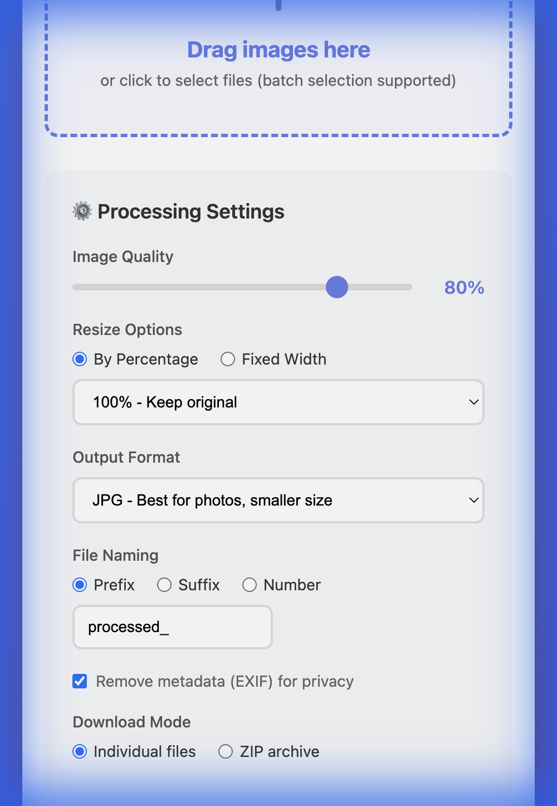
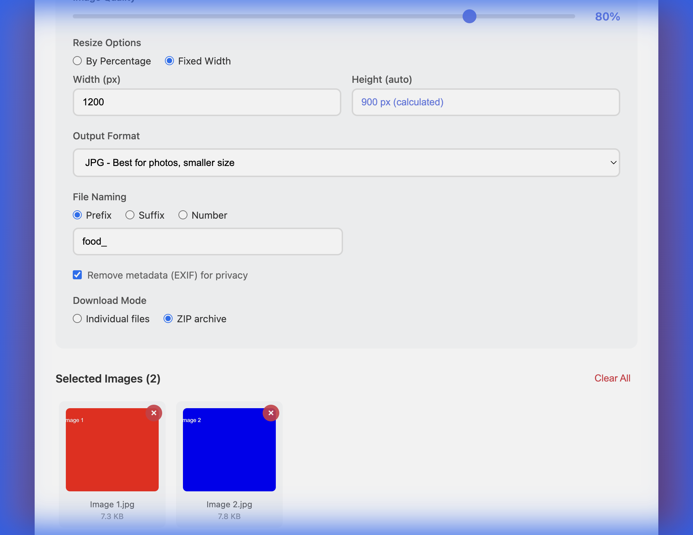

# Beijing Food Menu Image Processor

A powerful batch image processing tool designed for optimizing food photography and restaurant menu images. Pure HTML/CSS/JavaScript solution - works entirely in your browser.

[](https://opensource.org/licenses/MIT)

## 🌟 Features

- **Batch Processing**: Process multiple images simultaneously
- **Quality Adjustment**: Fine-tune image quality from 1-100%
- **Smart Resizing**: 
  - Percentage-based scaling (25%, 50%, 75%, 100%, 150%, 200%)
  - Fixed width with auto-calculated height (dynamic preview)
- **Format Conversion**: Convert between JPEG, PNG, and WebP formats
- **File Naming Options**:
  - Prefix mode (e.g., `processed_image.jpg`)
  - Suffix mode (e.g., `image_processed.jpg`)
  - Number mode (e.g., `image_001.jpg`)
- **Privacy Protection**: Remove EXIF metadata for privacy
- **Download Modes**:
  - Individual files download
  - ZIP archive download (batch export)
- **User-Friendly Interface**: Modern, responsive design with drag-and-drop support
- **Pure Client-Side**: All processing happens in your browser, no upload required

## 🍜 About Beijing Food Menu

This tool was created to support [beijingfoodmenu.com](https://www.beijingfoodmenu.com/), a comprehensive guide to Beijing's culinary scene. We use this processor to optimize thousands of food photos, ensuring fast loading times while maintaining visual quality.

**Use Cases:**
- Optimize restaurant menu photos for web display
- Batch resize food photography for social media
- Convert images to modern WebP format for better performance
- Reduce file sizes while preserving food presentation quality

## 📸 Screenshots

### Main Interface


### Usage Demo


## 🚀 Quick Start

### Online Use

1. **Visit GitHub Repository**: [https://github.com/jiangmitravel/beijingfoodmenu-image-tools](https://github.com/jiangmitravel/beijingfoodmenu-image-tools)
2. **Download**: Click the green "Code" button → Download ZIP


### How to Use

1. Drag and drop your images or click to select
2. Adjust settings (quality, size, format)
3. Choose file naming and download mode
4. Click "Start Processing"
5. Processed images download automatically

## 📖 Usage Guide

### Processing Settings

#### Image Quality
- **1-100%**: Adjust compression level
- **Recommended**: 75-80% for web, 90-95% for print

#### Resize Options
- **By Percentage**: Scale to 25%, 50%, 75%, 100%, 150%, or 200%
- **Fixed Width**: Set specific width in pixels, height auto-calculated

#### Output Format
- **JPEG**: Best for photos, smaller file size
- **PNG**: Supports transparency, higher quality
- **WebP**: Modern format, 25-35% smaller than JPEG

#### File Naming
- **Prefix**: Add text before filename (e.g., `food_dish.jpg`)
- **Suffix**: Add text after filename (e.g., `dish_food.jpg`)
- **Number**: Sequential numbering (e.g., `image_001.jpg`)

#### Download Mode
- **Individual Files**: Download each image separately
- **ZIP Archive**: Package all images into a single ZIP file

### Tips for Food Photography

- **Web Display**: 75-80% quality, WebP format
- **Print Menus**: 90-95% quality, PNG format
- **Social Media**: 1200px width, 85% quality
- **Thumbnails**: 25-50% size, 70% quality

## 🛠️ Technical Details

### Supported Formats
- **Input**: JPEG, PNG, WebP, BMP, GIF
- **Output**: JPEG, PNG, WebP

### Browser Compatibility
- Chrome/Edge 90+
- Firefox 88+
- Safari 14+
- Opera 76+

### Pure Client-Side Processing
- No server upload required
- Complete privacy - images never leave your device
- Works offline after initial load

## 📁 Project Structure

```
beijingfoodmenu-image-tools/
├── index.html                 # Main application
├── README.md                  # This file
├── LICENSE                    # MIT License
├── CHANGELOG.md              # Version history
├── .gitignore                # Git ignore rules
└── docs/
    ├── screenshots/          # Interface screenshots
    └── examples/             # Sample images
```

## 🤝 Contributing

Contributions are welcome! Please feel free to submit a Pull Request.

## 📄 License

This project is licensed under the MIT License - see the [LICENSE](LICENSE) file for details.

## 🔗 Related Links

- **Beijing Food Menu**: [https://www.beijingfoodmenu.com/](https://www.beijingfoodmenu.com/)
- **GitHub Repository**: [https://github.com/jiangmitravel/beijingfoodmenu-image-tools](https://github.com/jiangmitravel/beijingfoodmenu-image-tools)
- **Report Issues**: [GitHub Issues](https://github.com/jiangmitravel/beijingfoodmenu-image-tools/issues)

## 💡 Inspiration

This tool was born from the need to efficiently process thousands of food photos for beijingfoodmenu.com. We're sharing it with the community to help other food enthusiasts, restaurant owners, and web developers optimize their culinary imagery.

---

**Made with ❤️ for the food photography community**

*If this tool helps your project, consider linking back to [beijingfoodmenu.com](https://www.beijingfoodmenu.com/) to support our work!*
